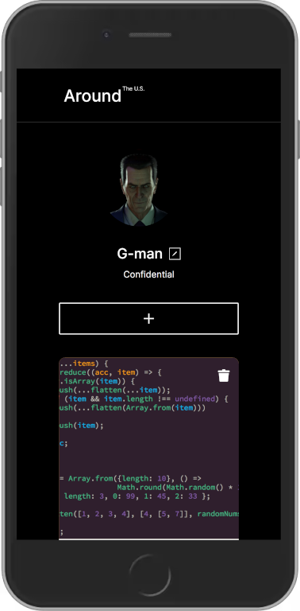
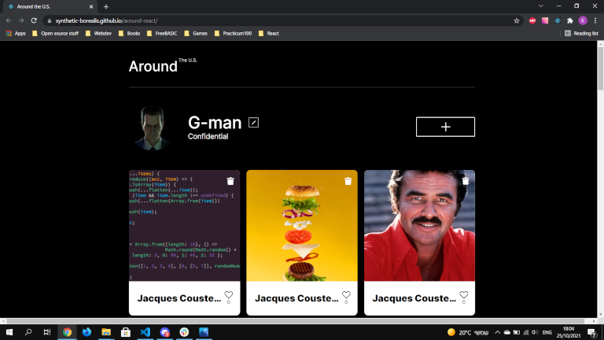

# Project 9: Around The U.S.

## Description
A one page website for travellers. The website is responsive and should display well on different devices and resolutions (including PCs, tablets & mobile phones).

## Built With
- HTML5
- CSS
- [React](https://reactjs.org/)

## Possible Improvements
-

## Showcase
<!-- <figure>
  
  <figcaption>Fig. 1: The website running inside Chrome's device emulator.</figcaption>
</figure>

 

<figure>
  
  <figcaption>Fig. 2: The website running normally inside Chrome.</figcaption>
</figure> -->
